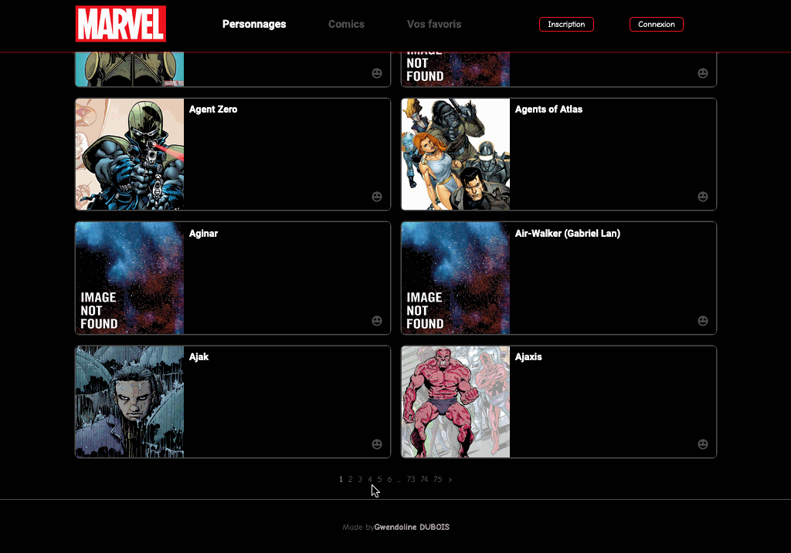

<div align="center">

</div>

<div align="center">
  <h1> Marvel </h1>
</div>

<div align="center">
  
</div>

#### Try it <a href="https://lucid-wing-f7265f.netlify.app/" target="_blank">online !</a>

## 🖥 Features

- SignUp and LogIn
- Visualize all characters and comics, and search by name
- Page with all comics that contains a specific character
- Add/see favorites (only if connected)
- Update username and avatar
- User's accounts are stored in a MongoDB database (to see backend repository, click <a href="https://github.com/GwendolineD/Marvel-backend" target="_blank">here</a>)

## 📸 Screen shots

<div align="center" >

  
  </div>
  
<div align="center">
  
  
</div>

## 🛠 Technologies, packages ...

- React
- React-router-dom
- react-loader-spinner
- react-paginate
- Axios
- js-cookie
- @fortawesome
- Yarn

## 👀 Run the project

Clone the repository :

```
git clone https://github.com/GwendolineD/Marvel-frontend.git
cd Marvel-frontend
```

Install the dependencies :

```
yarn install
```

Then run the project :

```
yarn start
```
